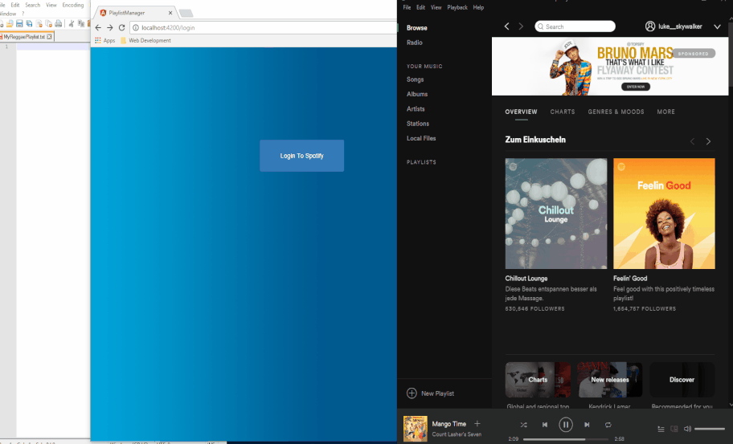

# PlaylistManager
This is a web application that allows the user to generate a spotify playlist from a list of songs in a txt file.
Built during UCLA's 2017 Hackathon

## Developers
- Gianluca Guarro
- David Carranza

## Implementation
- Text parsing to retrieve songs/artists
- OAuth flow with spotify
- Usage of Spotify API (create/delete playlists, add/remove songs to/from playlist)
- Graphical user interface (GUI)

<!-- ## Development server

Run `ng serve` for a dev server. Navigate to `http://localhost:4200/`. The app will automatically reload if you change any of the source files.

## Code scaffolding

Run `ng generate component component-name` to generate a new component. You can also use `ng generate directive/pipe/service/class/module`.

## Build

Run `ng build` to build the project. The build artifacts will be stored in the `dist/` directory. Use the `-prod` flag for a production build.

## Running unit tests

Run `ng test` to execute the unit tests via [Karma](https://karma-runner.github.io).

## Running end-to-end tests

Run `ng e2e` to execute the end-to-end tests via [Protractor](http://www.protractortest.org/).
Before running the tests make sure you are serving the app via `ng serve`.

## Further help

To get more help on the Angular CLI use `ng help` or go check out the [Angular CLI README](https://github.com/angular/angular-cli/blob/master/README.md).

Also David was here :>
 -->
